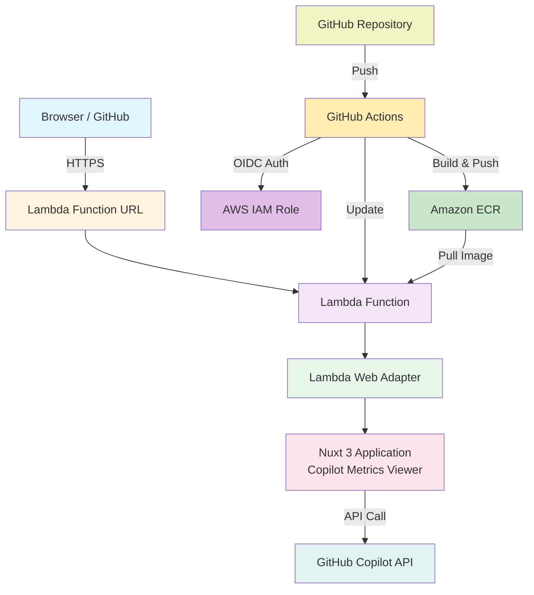
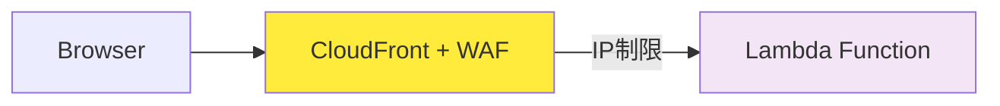
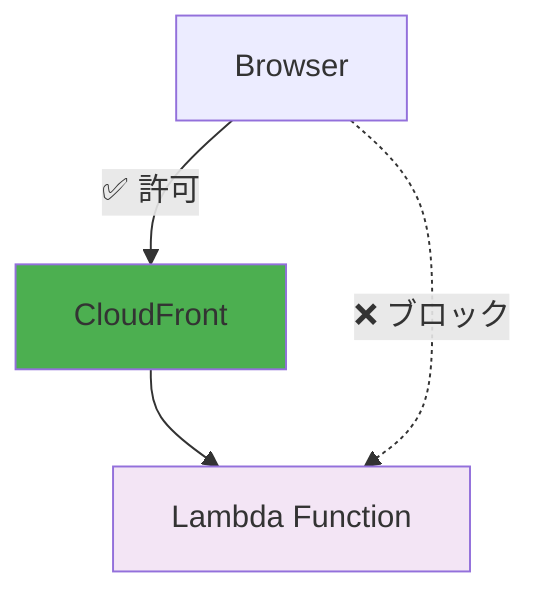
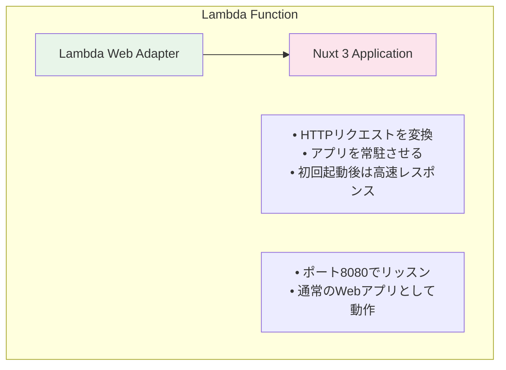

# Copilot Metrics Viewer - Lambda Function URLs

GitHub Copilot Metrics ViewerをAWS Lambda Function URLsでデプロイする構成です。

## 📊 アーキテクチャ



## 🏗️ 作成されるAWSリソース

### コアリソース（常に作成）
| リソース | 用途 | 備考 |
|----------|------|------|
| **ECRリポジトリ** | コンテナイメージ保存 | `copilot-metrics-viewer` |
| **ECRライフサイクルポリシー** | コスト最適化 | 最新3つのイメージを保持 |
| **Lambda関数** | アプリケーション実行環境 | 1024MBメモリ、30秒タイムアウト |
| **Lambda Function URL** | HTTPSエンドポイント | パブリックまたはIAM認証 |
| **IAMロール**（Lambda用） | Lambda実行権限 | 基本実行権限 + CloudWatch |
| **CloudWatch Log Group** | アプリケーションログ | 設定可能な保持期間 |

### GitHub Actionsリソース（常に作成）
| リソース | 用途 | 備考 |
|----------|------|------|
| **IAMロール**（GitHub Actions用） | CI/CD権限 | OIDC認証ベース |
| **IAMポリシー** | ECR + Lambda アクセス | イメージpush、関数更新 |

### オプションのセキュリティリソース
| リソース | 条件 | 用途 |
|----------|------|------|
| **CloudFrontディストリビューション** | `enable_cloudfront = true` | CDN + カスタムドメイン対応 |
| **CloudFront OAC** | `use_iam_auth = true` | オリジンアクセス制御 |
| **WAF Web ACL** | `enable_waf = true` | IPベースアクセス制御 |
| **WAF IP Set** | `enable_waf = true` | 許可IPアドレス |
| **追加IAMリソース** | `use_iam_auth = true` | CloudFront → Lambda 権限 |

### 設定別リソース数
| 設定 | 総リソース数 | 月額コスト |
|------|-------------|------------|
| 基本（セキュリティなし） | 約8リソース | $0.63-$1.10 |
| + CloudFront | 約9リソース | $0.63-$1.10 |
| + WAF | 約11リソース | $2.83-$3.30 |
| + IAM認証 | 約13リソース | $0.63-$1.10 |

## 💰 コスト見積もり

| 項目 | 月額コスト |
|------|-----------|
| Lambda実行時間 | $0.03-0.50 |
| Lambda リクエスト | $0.00 |
| ECR ストレージ | $0.10 |
| CloudWatch Logs | $0.50 |
| **合計** | **$0.63-1.10** |

### 他の構成との比較

| 構成 | 平日のみ | 24時間 | HTTPS | 固定URL |
|------|---------|--------|-------|---------|
| **Lambda Function URLs** | **$0.63-1** | **$1-2** | ✅ | ✅ |
| Fargate + CloudFront | $10-15 | $30-40 | ✅ | ✅ |
| Fargate + ALB | $26-33 | $50-60 | ✅ | ✅ |

💡 **Lambda Function URLsが最もコスト効率が良い！**

## ✨ 特徴

- ✅ **低コスト**: 使った分だけ課金（月$1-2程度）
- ✅ **HTTPS対応**: Lambda Function URLsが自動提供
- ✅ **固定URL**: デプロイ後も変わらない
- ✅ **スケーラブル**: 自動スケーリング
- ✅ **メンテナンスフリー**: サーバー管理不要
- ✅ **高速起動**: Lambda Web Adapterで初回以降は高速

## 🚀 クイックスタート

### GitHub Actions自動デプロイ（推奨）

**注意**: 
- 本プロジェクトは既存のOSS（[github-copilot-resources/copilot-metrics-viewer](https://github.com/github-copilot-resources/copilot-metrics-viewer)）を利用しています。
- Lambda Web Adapterを使用しており、Dockerfileで組み込みを行う処理が必要です。
- それ以外はOSSそのまま利用しています。
- そのためGitHub Actionsで、Lambda関数直接更新を採用しています。
- **通常の運用では、CodePipelineを使用したCI/CDパイプラインの構築を強く推奨します。**

**自動デプロイ機能**:
- **コード変更時**: `main`ブランチへのpushで自動デプロイ
- **upstream更新**: 毎月15日9:15（JST）にupstreamの更新をチェックし、新バージョンがあれば自動デプロイ

```bash
# 1. terraform.tfvarsを設定
cp terraform.tfvars.example terraform.tfvars
# github_repository = "your-org/repo-name" を設定

# 2. IAMロールを作成
terraform apply

# 3. GitHub Secretsを設定（GitHub Actions用に必要）
# GitHubリポジトリ → Settings → Secrets and variables → Actions
# 以下のシークレットを追加:
# - AWS_ACCOUNT_ID: 12桁のAWSアカウントID（例: 123456789012）
#   アカウントIDの確認: aws sts get-caller-identity --query Account --output text

# 4. GitHubにpushすると自動デプロイ
git push origin main
```

### 手動デプロイ

### 前提条件

- ✅ Terraform >= 1.0
- ✅ AWS CLI設定済み
- ✅ Docker（イメージビルド用）
- ✅ GitHub Personal Access Token または GitHub App

### 5分でデプロイ

```bash
# 1. リポジトリをクローン
git clone <this-repo>
cd copilot-metrics-viewer-lambda

# 2. 環境変数を設定
cp terraform.tfvars.example terraform.tfvars
# terraform.tfvarsを編集（後述）

# 3. ECRリポジトリを作成
terraform init
terraform apply -target=aws_ecr_repository.app

# 4. Dockerイメージをpush（CloudShellで実行）
bash build-and-push.sh ap-northeast-1 latest

# 5. Lambda関数をデプロイ
terraform apply

# 6. URLを確認
terraform output function_url
```

## 🔐 GitHub認証の設定

### オプション1: Personal Access Token（簡単）

1. [GitHub Personal Access Token](https://github.com/settings/tokens)を作成
2. 必要なスコープ:
   - `copilot`
   - `manage_billing:copilot`
   - `manage_billing:enterprise`
   - `read:enterprise`
   - `read:org`

### オプション2: GitHub App（推奨）

```
┌─────────────────────────────────────────────┐
│  GitHub App                                 │
│  ┌───────────────────────────────────────┐ │
│  │ Homepage URL:                         │ │
│  │ https://your-lambda-url.on.aws/       │ │
│  │                                       │ │
│  │ Callback URL:                         │ │
│  │ https://your-lambda-url.on.aws/       │ │
│  │        /api/auth/github               │ │
│  └───────────────────────────────────────┘ │
│                                             │
│  Permissions:                               │
│  • Copilot business: Read-only             │
│  • Members: Read-only                      │
│  • Administration: Read-only (enterprise)  │
└─────────────────────────────────────────────┘
```

1. [GitHub App](https://github.com/organizations/YOUR_ORG/settings/apps)を作成
2. 上記の設定を行う
3. Client IDとClient Secretを取得

## ⚙️ 環境変数の設定

`terraform.tfvars`を編集:

```hcl
# GitHub Actions設定
github_repository = "your-org/copilot-metrics-viewer-lambda"

# ECRライフサイクルポリシー設定
ecr_lifecycle_untagged_count = 3  # 保持するタグなしイメージ数

# CloudWatch Logs設定
cloudwatch_logs_retention_days = 7  # ログ保持期間（日数）

# セキュリティオプション
enable_cloudfront = false  # CloudFrontを有効化
enable_waf        = false  # WAFを有効化
use_iam_auth      = false  # IAM認証を使用
allowed_ip_addresses = []  # 許可するIPアドレス範囲

environment_variables = {
  # 必須: セッション暗号化用（32文字以上）
  NUXT_SESSION_PASSWORD = "your-32-character-or-longer-password"
  
  # ━━━━━━━━━━━━━━━━━━━━━━━━━━━━━━━━━━━━━━
  # 認証方法を選択（どちらか一方）
  # ━━━━━━━━━━━━━━━━━━━━━━━━━━━━━━━━━━━━━━
  
  # 【方法1】Personal Access Token
  NUXT_GITHUB_TOKEN = "ghp_xxxxxxxxxxxx"
  
  # 【方法2】GitHub App（推奨）
  NUXT_PUBLIC_USING_GITHUB_AUTH = "true"
  NUXT_OAUTH_GITHUB_CLIENT_ID     = "Iv1.xxxxxxxxxxxx"
  NUXT_OAUTH_GITHUB_CLIENT_SECRET = "xxxxxxxxxxxxxxxxxxxx"
  
  # ━━━━━━━━━━━━━━━━━━━━━━━━━━━━━━━━━━━━━━
  # スコープ設定
  # ━━━━━━━━━━━━━━━━━━━━━━━━━━━━━━━━━━━━━━
  
  NUXT_PUBLIC_SCOPE      = "organization"  # organization / enterprise / team-organization / team-enterprise
  NUXT_PUBLIC_GITHUB_ORG = "your-org-name"
  
  # Enterprise使用時
  # NUXT_PUBLIC_GITHUB_ENT = "your-enterprise-name"
  
  # Team使用時
  # NUXT_PUBLIC_GITHUB_TEAM = "your-team-slug"
}
```

### 32文字のランダムパスワード生成

```bash
openssl rand -base64 24
```

## 📝 デプロイ手順（詳細）

### 1. 環境変数の設定

```bash
cp terraform.tfvars.example terraform.tfvars
vim terraform.tfvars  # または好きなエディタで編集
```

### 2. ECRリポジトリを作成

```bash
terraform init
terraform apply -target=aws_ecr_repository.app
```

### 3. DockerイメージをECRにpush

```bash
# ECRにログイン
aws ecr get-login-password --region ap-northeast-1 | docker login --username AWS --password-stdin <ACCOUNT_ID>.dkr.ecr.ap-northeast-1.amazonaws.com

# イメージをビルド（注意: Dockerfileは docker/ ディレクトリにあります）
docker build -f docker/Dockerfile -t copilot-metrics-viewer .

# タグ付け
docker tag copilot-metrics-viewer:latest <ACCOUNT_ID>.dkr.ecr.ap-northeast-1.amazonaws.com/copilot-metrics-viewer:latest

# ECRにpush
docker push <ACCOUNT_ID>.dkr.ecr.ap-northeast-1.amazonaws.com/copilot-metrics-viewer:latest
```

### 4. Lambda関数をデプロイ

```bash
terraform apply
```

出力例:
```
Outputs:

function_arn = "arn:aws:lambda:ap-northeast-1:123456789012:function:copilot-metrics-viewer"
function_name = "copilot-metrics-viewer"
function_url = "https://xxxxx.lambda-url.ap-northeast-1.on.aws/"
```

### 5. Function URLの確認

```bash
terraform output function_url
```

### 6. GitHub Appの設定を更新（GitHub App使用時）

デプロイ後、GitHub AppのHomepage URLとCallback URLを実際のLambda Function URLに更新してください。

## 🎯 動作確認

1. ブラウザでFunction URLにアクセス
2. "Sign in with GitHub"ボタンをクリック
3. GitHub認証を完了
4. メトリクスダッシュボードが表示される

```
┌─────────────────────────────────────────┐
│  Copilot Metrics Viewer                 │
│  ┌───────────────────────────────────┐  │
│  │ Organization: your-org            │  │
│  │                                   │  │
│  │ [organization] [teams] [languages]│  │
│  │                                   │  │
│  │  📊 Acceptance Rate: 45%         │  │
│  │  📈 Total Suggestions: 12,345    │  │
│  │  👥 Active Users: 42             │  │
│  └───────────────────────────────────┘  │
└─────────────────────────────────────────┘
```

## 📦 ECRライフサイクルポリシー

### 概要

コンテナイメージのストレージコストを最適化するため、自動的に古いイメージを削除するライフサイクルポリシーを適用しています。

**💰 コスト効果**: 月額ECRストレージ費用を約70%削減（$0.30 → $0.10）

### ポリシー詳細

| ルール | 対象タグ | 保持期間/数 | 目的 | 例 |
|--------|----------|-------------|------|-----|
| 1 | `latest` | 最新3つ | 破壊的変更対策 | `latest` |
| 2 | 数字開始（0-9） | 90日間 | コミットハッシュ保持 | `2e9ab5cf...` |
| 3 | 英字開始（a-f） | 90日間 | コミットハッシュ保持 | `a1b2c3d4...` |
| 4 | タグなし | 最新3つ | ビルド中間イメージ | `<untagged>` |

### 🔄 自動タグ付け戦略

GitHub Actionsが以下のタグを自動付与：

```bash
# デプロイ時に作成されるタグ
latest                    # 常に最新版を指す
2e9ab5cf0c081df5e11a6d   # コミットハッシュ（ロールバック用）
```

### ⚙️ 設定変更

`terraform.tfvars`で保持数を調整可能：

```hcl
# 保持するタグなしイメージ数を変更
ecr_lifecycle_untagged_count = 5  # デフォルト: 3

# 保持期間は variables.tf で設定済み（90日間）
```

### 🔙 ロールバック方法

問題が発生した場合、特定のコミットハッシュに戻せます：

```bash
# 1. ECRのイメージ一覧を確認
aws ecr describe-images --repository-name copilot-metrics-viewer \
  --query 'imageDetails[*].[imageTags[0],imageDigest,imagePushedAt]' \
  --output table

# 2. 特定のコミットハッシュに戻す
aws lambda update-function-code \
  --function-name copilot-metrics-viewer \
  --image-uri <ACCOUNT_ID>.dkr.ecr.ap-northeast-1.amazonaws.com/copilot-metrics-viewer:2e9ab5cf0c081df5e11a6d643daccbb29010fbc8

# 3. 動作確認
curl -I https://your-lambda-url.lambda-url.ap-northeast-1.on.aws/
```

### 📊 ストレージ使用量確認

```bash
# ECRリポジトリのサイズを確認
aws ecr describe-repositories --repository-names copilot-metrics-viewer \
  --query 'repositories[0].repositorySizeInBytes' --output text | \
  awk '{print $1/1024/1024 " MB"}'

# イメージ数を確認
aws ecr describe-images --repository-name copilot-metrics-viewer \
  --query 'length(imageDetails)'
```

## 🔧 トラブルシューティング

### Lambda関数がタイムアウトする

メモリサイズを増やしてください:

```hcl
# main.tf
resource "aws_lambda_function" "app" {
  memory_size = 2048  # デフォルト: 1024
  timeout     = 60    # デフォルト: 30
}
```

### GitHub App認証が動作しない

1. ✅ Callback URLが正しいか確認
   - `https://your-lambda-url/api/auth/github`
2. ✅ GitHub Appの権限が正しいか確認
3. ✅ CloudWatch Logsでエラーを確認

```bash
aws logs tail /aws/lambda/copilot-metrics-viewer --follow
```

### 環境変数が反映されない

Lambda関数を再作成:

```bash
terraform taint aws_lambda_function.app
terraform apply
```

## 📊 CloudWatch Logs確認

```bash
# リアルタイムでログを確認
aws logs tail /aws/lambda/copilot-metrics-viewer --follow

# 過去5分のログを確認
aws logs tail /aws/lambda/copilot-metrics-viewer --since 5m
```

## 🗑️ リソース削除

```bash
terraform destroy
```

確認メッセージが表示されたら`yes`を入力。

## 📚 関連ドキュメント

- [IP-RESTRICTION-GUIDE.md](./doc/ja/IP-RESTRICTION-GUIDE.md) - IP制限の実装方法
- [CLOUDFRONT-ONLY-ACCESS.md](./doc/ja/CLOUDFRONT-ONLY-ACCESS.md) - CloudFront経由のみアクセス許可
- [SECRETS-MANAGEMENT.md](./doc/ja/SECRETS-MANAGEMENT.md) - セキュアなシークレット管理ガイド

## 🔒 セキュリティ強化（オプション）

### セキュリティレベル比較

| 設定 | セキュリティ | 複雑さ | 月額コスト |
|------|-------------|--------|------------|
| `enable_cloudfront = false` | 低 | 低 | $0.63-$1.10 |
| `enable_cloudfront = true` | 中 | 中 | $0.63-$1.10 |
| `enable_waf = true` | 高 | 中 | $2.83-$3.30 |
| `use_iam_auth = true` | **最高** | 高 | $0.63-$1.10 |

### 設定オプション

```hcl
# terraform.tfvars
enable_cloudfront = true   # CloudFrontディストリビューションを有効化
enable_waf        = true   # IP制限付きWAFを有効化
use_iam_auth      = true   # IAM認証を使用（最も安全）
allowed_ip_addresses = ["203.0.113.0/24"]  # オフィスのIP範囲

# CloudWatch Logs保持期間設定
cloudwatch_logs_retention_days = 7  # デフォルト: 7日間
```

**推奨設定:**
- **開発環境**: `enable_cloudfront = false` (最もシンプル)
- **本番環境**: `use_iam_auth = true` (最も安全、低コスト)
- **高セキュリティ**: 全オプション有効 (最高セキュリティ、高コスト)

**重要な制約:**
- `use_iam_auth = true` を使用する場合は `enable_cloudfront = true` が必須
- WAFを有効にするとコストが約$2.20/月増加
- CloudFrontは無料枠が充実（月1TB転送、1000万リクエスト）

### IP制限を追加

特定のIPアドレスからのみアクセスを許可:



詳細: [IP-RESTRICTION-GUIDE.md](./doc/IP-RESTRICTION-GUIDE.md)

### CloudFront経由のみ許可

直接アクセスをブロック:



詳細: [CLOUDFRONT-ONLY-ACCESS.md](./doc/CLOUDFRONT-ONLY-ACCESS.md)

## 🏗️ アーキテクチャの詳細

### Lambda Web Adapterとは



**メリット**:
- 既存のWebアプリをそのままLambdaで実行
- コールドスタート後は高速（0.1秒程度）
- コスト効率が良い

## 📈 パフォーマンス

| 指標 | 値 |
|------|-----|
| コールドスタート | 10-30秒（初回のみ） |
| ウォームスタート | 0.1-0.5秒 |
| メモリ使用量 | 150-200MB |
| 同時実行数 | 自動スケーリング |

## 🤝 サポート

問題が発生した場合:

1. CloudWatch Logsを確認
2. [GitHub Issues](https://github.com/github-copilot-resources/copilot-metrics-viewer/issues)を確認
3. 環境変数の設定を再確認

## 📄 ライセンス

このリポジトリのライセンス全文はリポジトリルートの `LICENSE` ファイルに記載しています。詳しくは以下を参照してください。

See: ./LICENSE
