# Copilot Metrics Viewer - Lambda Function URLs

This repository contains configuration to deploy the GitHub Copilot Metrics Viewer using AWS Lambda Function URLs.

[日本語はこちら](./README.ja.md)

## 📊 Architecture


## 🏗️ AWS Resources Created

### Core Resources (Always Created)
| Resource | Purpose | Notes |
|----------|---------|-------|
| **ECR Repository** | Container image storage | `copilot-metrics-viewer` |
| **ECR Lifecycle Policy** | Cost optimization | Keeps latest 3 images |
| **Lambda Function** | Application runtime | 1024MB memory, 30s timeout |
| **Lambda Function URL** | HTTPS endpoint | Public or IAM-authenticated |
| **IAM Role** (Lambda) | Lambda execution permissions | Basic execution + CloudWatch |
| **CloudWatch Log Group** | Application logs | Configurable retention period |

### GitHub Actions Resources (Always Created)
| Resource | Purpose | Notes |
|----------|---------|-------|
| **IAM Role** (GitHub Actions) | CI/CD permissions | OIDC-based authentication |
| **IAM Policies** | ECR + Lambda access | Push images, update function |

### Optional Security Resources
| Resource | Condition | Purpose |
|----------|-----------|---------|
| **CloudFront Distribution** | `enable_cloudfront = true` | CDN + custom domain support |
| **CloudFront OAC** | `use_iam_auth = true` | Origin access control |
| **WAF Web ACL** | `enable_waf = true` | IP-based access control |
| **WAF IP Set** | `enable_waf = true` | Allowed IP addresses |
| **Additional IAM Resources** | `use_iam_auth = true` | CloudFront → Lambda permissions |

### Resource Count by Configuration
| Configuration | Total Resources | Monthly Cost |
|---------------|-----------------|--------------|
| Basic (no security) | ~8 resources | $0.63-$1.10 |
| + CloudFront | ~9 resources | $0.63-$1.10 |
| + WAF | ~11 resources | $2.83-$3.30 |
| + IAM Auth | ~13 resources | $0.63-$1.10 |

## 💰 Cost Estimate

| Item | Monthly cost |
|------|---------------|
| Lambda execution time | $0.03 - $0.50 |
| Lambda requests | $0.00 |
| ECR storage | $0.10 |
| CloudWatch Logs | $0.50 |
| **Total** | **$0.63 - $1.10** |

### Comparison with other setups

| Setup | Weekdays only | 24/7 | HTTPS | Fixed URL |
|-------|---------------|------|-------|-----------|
| **Lambda Function URLs** | **$0.63 - $1** | **$1 - $2** | ✅ | ✅ |
| Fargate + CloudFront | $10 - $15 | $30 - $40 | ✅ | ✅ |
| Fargate + ALB | $26 - $33 | $50 - $60 | ✅ | ✅ |

Tip: Lambda Function URLs are the most cost-effective option for this workload.

## ✨ Highlights

- ✅ Low cost: pay only for what you use (roughly $1-2/month)
- ✅ HTTPS: provided automatically by Lambda Function URLs
- ✅ Fixed URL: the function URL remains stable after deployment
- ✅ Scalable: automatic scaling
- ✅ Maintenance-free: no server management
- ✅ Fast warm response: Lambda Web Adapter improves responsiveness after cold start

## 🚀 Quick Start

### Recommended: Automatic deploy via GitHub Actions

Notes:
- This project reuses the upstream OSS project: https://github.com/github-copilot-resources/copilot-metrics-viewer
- It uses Lambda Web Adapter and requires building a Docker image via the included Dockerfile.
- The repo applies minimal modifications and relies on GitHub Actions to update the Lambda function directly.
- For production CI/CD, consider using CodePipeline or another managed pipeline instead.

Automatic deployment features:
- On code changes: push to the `main` branch triggers automatic deployment
- Upstream updates: checks upstream monthly (15th at 09:15 JST) and deploys new releases automatically if available

```bash
# 1. Configure terraform.tfvars
cp terraform.tfvars.example terraform.tfvars
# Set github_repository = "your-org/repo-name"

# 2. Create IAM roles and initial resources
terraform apply

# 3. Set up GitHub Secrets (required for GitHub Actions)
# Go to your GitHub repository → Settings → Secrets and variables → Actions
# Add the following secret:
# - AWS_ACCOUNT_ID: Your 12-digit AWS account ID (e.g., 123456789012)
#   To find your account ID: aws sts get-caller-identity --query Account --output text

# 4. Push to GitHub to trigger CI/CD
git push origin main
```

### Manual deployment

Prerequisites

- ✅ Terraform >= 1.0
- ✅ AWS CLI configured
- ✅ Docker (for building images)
- ✅ GitHub Personal Access Token or GitHub App

5-minute deploy

```bash
# 1. Clone the repository
git clone <this-repo>
cd copilot-metrics-viewer-lambda

# 2. Prepare environment variables
cp terraform.tfvars.example terraform.tfvars
# Edit terraform.tfvars as described below

# 3. Create ECR repository
terraform init
terraform apply -target=aws_ecr_repository.app

# 4. Build and push the Docker image (CloudShell recommended)
bash build-and-push.sh ap-northeast-1 latest

# 5. Deploy the Lambda function
terraform apply

# 6. Get the Function URL
terraform output function_url
```

## 🔐 GitHub authentication

Choose one of the following authentication methods.

### Option 1: Personal Access Token (easy)

1. Create a GitHub Personal Access Token: https://github.com/settings/tokens
2. Required scopes:
   - `copilot`
   - `manage_billing:copilot`
   - `manage_billing:enterprise`
   - `read:enterprise`
   - `read:org`

### Option 2: GitHub App (recommended)

Recommended app settings:

```
┌─────────────────────────────────────────────┐
│  GitHub App                                 │
│  ┌───────────────────────────────────────┐ │
│  │ Homepage URL:                         │ │
│  │ https://your-lambda-url.on.aws/       │ │
│  │                                       │ │
│  │ Callback URL:                         │ │
│  │ https://your-lambda-url.on.aws/       │ │
│  │        /api/auth/github               │ │
│  └───────────────────────────────────────┘ │
│                                             │
│  Permissions:                               │
│  • Copilot business: Read-only             │  │
│  • Members: Read-only                      │  │
│  • Administration: Read-only (enterprise)  │ │
└─────────────────────────────────────────────┘
```

1. Create a GitHub App under your organization: https://github.com/organizations/YOUR_ORG/settings/apps
2. Configure the URLs and permissions above
3. Obtain the Client ID and Client Secret

## ⚙️ Environment variables

Edit `terraform.tfvars`:

```hcl
# GitHub Actions settings
github_repository = "your-org/copilot-metrics-viewer-lambda"

# ECR lifecycle policy: number of untagged images to keep
ecr_lifecycle_untagged_count = 3

# CloudWatch Logs retention period (days)
cloudwatch_logs_retention_days = 7

# Security options
enable_cloudfront = false  # Enable CloudFront distribution
enable_waf        = false  # Enable WAF with IP restrictions
use_iam_auth      = false  # Use IAM authentication (most secure)
allowed_ip_addresses = []  # Your office IP ranges

environment_variables = {
  # Required: session encryption key (32 characters or longer)
  NUXT_SESSION_PASSWORD = "your-32-character-or-longer-password"

  # Choose ONE authentication method below

  # Method 1: Personal Access Token
  NUXT_GITHUB_TOKEN = "ghp_xxxxxxxxxxxx"

  # Method 2: GitHub App (recommended)
  NUXT_PUBLIC_USING_GITHUB_AUTH = "true"
  NUXT_OAUTH_GITHUB_CLIENT_ID     = "Iv1.xxxxxxxxxxxx"
  NUXT_OAUTH_GITHUB_CLIENT_SECRET = "xxxxxxxxxxxxxxxxxxxx"

  # Scope settings
  NUXT_PUBLIC_SCOPE      = "organization"  # organization / enterprise / team-organization / team-enterprise
  NUXT_PUBLIC_GITHUB_ORG = "your-org-name"

  # For enterprise
  # NUXT_PUBLIC_GITHUB_ENT = "your-enterprise-name"

  # For team
  # NUXT_PUBLIC_GITHUB_TEAM = "your-team-slug"
}
```

Generate a 32+ character random password:

```bash
openssl rand -base64 24
```

## Detailed deployment steps

### 1. Prepare environment variables

```bash
cp terraform.tfvars.example terraform.tfvars
vim terraform.tfvars  # or your editor of choice
```

### 2. Create the ECR repository

```bash
terraform init
terraform apply -target=aws_ecr_repository.app
```

### 3. Build and push the Docker image to ECR

```bash
# Login to ECR
aws ecr get-login-password --region ap-northeast-1 | docker login --username AWS --password-stdin <ACCOUNT_ID>.dkr.ecr.ap-northeast-1.amazonaws.com

# Build the image (note: Dockerfile is in docker/ directory)
docker build -f docker/Dockerfile -t copilot-metrics-viewer .

# Tag the image
docker tag copilot-metrics-viewer:latest <ACCOUNT_ID>.dkr.ecr.ap-northeast-1.amazonaws.com/copilot-metrics-viewer:latest

# Push the image
docker push <ACCOUNT_ID>.dkr.ecr.ap-northeast-1.amazonaws.com/copilot-metrics-viewer:latest
```

### 4. Deploy the Lambda function

```bash
terraform apply
```

Example output:
```
Outputs:

function_arn = "arn:aws:lambda:ap-northeast-1:123456789012:function:copilot-metrics-viewer"
function_name = "copilot-metrics-viewer"
function_url = "https://xxxxx.lambda-url.ap-northeast-1.on.aws/"
```

### 5. Get the Function URL

```bash
terraform output function_url
```

### 6. Update GitHub App settings (if using GitHub App)

After deployment, update the GitHub App's Homepage URL and Callback URL to the deployed Function URL.

## 🎯 Verify application

1. Open the Function URL in your browser
2. Click "Sign in with GitHub"
3. Complete GitHub authentication
4. The metrics dashboard should load

Example UI:

```
┌─────────────────────────────────────────┐
│  Copilot Metrics Viewer                 │
│  ┌───────────────────────────────────┐  │
│  │ Organization: your-org            │  │
│  │                                   │  │
│  │ [organization] [teams] [languages]│  │
│  │                                   │  │
│  │  📊 Acceptance Rate: 45%         │  │
│  │  📈 Total Suggestions: 12,345    │  │
│  │  👥 Active Users: 42             │  │
│  └───────────────────────────────────┘  │
└─────────────────────────────────────────┘
```

## 📦 ECR lifecycle policy

### Overview

We apply an ECR lifecycle policy that automatically removes old images to optimize container storage costs.

**Cost impact**: reduces monthly ECR storage cost by ~70% (e.g. $0.30 -> $0.10)

### Policy details

| Rule | Tag pattern | Retention | Purpose | Example |
|------|-------------|-----------|---------|---------|
| 1 | `latest` | Keep latest 3 | Protect against destructive changes | `latest` |
| 2 | Starts with digits (0-9) | 90 days | Keep commit-hash tags | `2e9ab5cf...` |
| 3 | Starts with letters (a-f) | 90 days | Keep commit-hash tags | `a1b2c3d4...` |
| 4 | Untagged images | Keep latest 3 | Build intermediate images | `<untagged>` |

### Tagging strategy

GitHub Actions automatically applies these tags:

```bash
# Tags created on deploy
latest                    # Always points to the most recent image
2e9ab5cf0c081df5e11a6d   # Commit hash tag (useful for rollback)
```

### Configuration

Adjust the number of untagged images to keep in `terraform.tfvars`:

```hcl
# Number of untagged images to retain
ecr_lifecycle_untagged_count = 5  # default: 3

# Retention period is set in variables.tf (default: 90 days)
```

### Rollback procedure

If an issue occurs, you can roll back to a specific commit hash:

```bash
# 1. List images in ECR
aws ecr describe-images --repository-name copilot-metrics-viewer \
  --query 'imageDetails[*].[imageTags[0],imageDigest,imagePushedAt]' \
  --output table

# 2. Update Lambda to use a specific image tag
aws lambda update-function-code \
  --function-name copilot-metrics-viewer \
  --image-uri <ACCOUNT_ID>.dkr.ecr.ap-northeast-1.amazonaws.com/copilot-metrics-viewer:2e9ab5cf0c081df5e11a6d643daccbb29010fbc8

# 3. Verify the endpoint
curl -I https://your-lambda-url.lambda-url.ap-northeast-1.on.aws/
```

### Storage usage checks

```bash
# Check repository size
aws ecr describe-repositories --repository-names copilot-metrics-viewer \
  --query 'repositories[0].repositorySizeInBytes' --output text | \
  awk '{print $1/1024/1024 " MB"}'

# Count images
aws ecr describe-images --repository-name copilot-metrics-viewer \
  --query 'length(imageDetails)'
```

## 🔧 Troubleshooting

### Lambda function times out

Increase memory and timeout settings:

```hcl
# main.tf
resource "aws_lambda_function" "app" {
  memory_size = 2048  # default: 1024
  timeout     = 60    # default: 30
}
```

### GitHub App authentication doesn't work

1. ✅ Verify the Callback URL is correct:
   - `https://your-lambda-url/api/auth/github`
2. ✅ Verify GitHub App permissions
3. ✅ Check CloudWatch Logs for errors

```bash
aws logs tail /aws/lambda/copilot-metrics-viewer --follow
```

### Environment variables not applied

Recreate the Lambda function:

```bash
terraform taint aws_lambda_function.app
terraform apply
```

## 📊 CloudWatch Logs

```bash
# Tail logs in real time
aws logs tail /aws/lambda/copilot-metrics-viewer --follow

# Tail logs from the last 5 minutes
aws logs tail /aws/lambda/copilot-metrics-viewer --since 5m
```

## 🗑️ Remove resources

```bash
terraform destroy
```

When prompted, type `yes` to confirm.

## 📚 Related documents

- [IP-RESTRICTION-GUIDE.md](./doc/en/IP-RESTRICTION-GUIDE.md) - Guide to implementing IP restrictions
- [CLOUDFRONT-ONLY-ACCESS.md](./doc/en/CLOUDFRONT-ONLY-ACCESS.md) - Restrict access to CloudFront only
- [SECRETS-MANAGEMENT.md](./doc/en/SECRETS-MANAGEMENT.md) - Secure secrets management guide

## 🔒 Optional security hardening

### Security Level Comparison

| Configuration | Security | Complexity | Monthly Cost |
|---------------|----------|------------|--------------|
| `enable_cloudfront = false` | Low | Low | $0.63-$1.10 |
| `enable_cloudfront = true` | Medium | Medium | $0.63-$1.10 |
| `enable_waf = true` | High | Medium | $2.83-$3.30 |
| `use_iam_auth = true` | **Highest** | High | $0.63-$1.10 |

### Configuration Options

```hcl
# terraform.tfvars
enable_cloudfront = true   # Enable CloudFront distribution
enable_waf        = true   # Enable WAF with IP restrictions
use_iam_auth      = true   # Use IAM authentication (most secure)
allowed_ip_addresses = ["203.0.113.0/24"]  # Your office IPs
```

**Recommended configurations:**
- **Development**: `enable_cloudfront = false` (simplest)
- **Production**: `use_iam_auth = true` (most secure, low cost)
- **High-security**: All options enabled (highest security, higher cost)

**Important constraints:**
- `use_iam_auth = true` requires `enable_cloudfront = true`
- Enabling WAF increases cost by ~$2.20/month
- CloudFront has generous free tier (1TB transfer, 10M requests monthly)

### Add IP restriction

Restrict access to specific client IP addresses:


See: [IP-RESTRICTION-GUIDE.md](./doc/IP-RESTRICTION-GUIDE.md)

### Allow access only via CloudFront

Block direct access and only allow through CloudFront:

```mermaid
graph TB
    A[Browser] -->|✅ Allowed| B[CloudFront]
    B --> C[Lambda Function]
    A -.->|❌ Blocked| C

    style B fill:#4caf50
    style C fill:#f3e5f5
```



See: [CLOUDFRONT-ONLY-ACCESS.md](./doc/CLOUDFRONT-ONLY-ACCESS.md)

## 🏗️ Architecture details

### What is Lambda Web Adapter?

```mermaid
graph TB
    subgraph Lambda["Lambda Function"]
        A[Lambda Web Adapter] --> B[Nuxt 3 Application]

        note1["• Converts incoming HTTP requests\n• Keeps the app resident in memory\n• Fast responses after the first cold start"]
        note2["• Listens on port 8080\n• Runs like a normal web app"]
    end

    style A fill:#e8f5e9
    style B fill:#fce4ec
```



Benefits:

- Run existing web applications on Lambda with minimal changes
- Fast response after warmup ( ~0.1s )
- Cost efficient

## 📈 Performance

| Metric | Value |
|--------|-------|
| Cold start | 10-30s (first request only) |
| Warm response | 0.1-0.5s |
| Memory usage | 150-200MB |
| Concurrency | Auto-scaling |

## 🤝 Support

If you run into issues:

1. Check CloudWatch Logs
2. Open an issue on the upstream project: https://github.com/github-copilot-resources/copilot-metrics-viewer/issues
3. Verify environment variable settings

## 📄 License

This deployment configuration is licensed under the MIT License. See `./LICENSE` for the full text.

Original application: https://github.com/github-copilot-resources/copilot-metrics-viewer
